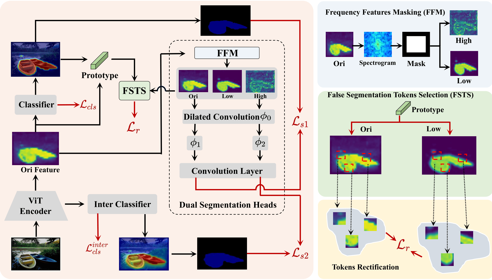

# FFR: Frequency Feature Rectification for Weakly Supervised Semantic Segmentation



The implementation of [**FFR: Frequency Feature Rectification for Weakly Supervised Semantic Segmentation**](https://openaccess.thecvf.com/content/CVPR2025/papers/Yang_FFR_Frequency_Feature_Rectification_for_Weakly_Supervised_Semantic_Segmentation_CVPR_2025_paper.pdf), Ziqian Yang∗, Xinqiao Zhao∗, Xiaolei Wang, Quan Zhang, Jimin Xiao, CVPR 2025.

## Abstract
Image-level Weakly Supervised Semantic Segmentation
(WSSS) has garnered significant attention due to its low an-
notation costs. Current single-stage state-of-the-art WSSS
methods mainly rely on Vision Transformer (ViT) to ex-
tract features from input images, generating more complete
segmentation results based on comprehensive semantic in-
formation. However, these ViT-based methods often suffer
from over-smoothing issues in segmentation results. In this
paper, we identify that attenuated high-frequency features
mislead the decoder of ViT-based WSSS models, resulting
in over-smoothed false segmentation. To address this, we
propose a Frequency Feature Rectification (FFR) frame-
work to rectify the false segmentations caused by attenuated
high-frequency features and enhance the learning of high-
frequency features in the decoder. Quantitative and qualita-
tive experimental results demonstrate that our FFR frame-
work can effectively address the attenuated high-frequency
caused over-smoothed segmentation issue and achieve new
state-of-the-art WSSS performances.

## Environment

- Python >= 3.6.6
- Pytorch >= 1.6.0
- Torchvision


## Data Preparation

### PASCAL VOC 2012

#### 1. Download

``` bash
wget http://host.robots.ox.ac.uk/pascal/VOC/voc2012/VOCtrainval_11-May-2012.tar
```
#### 2. Segmentation Labels

The augmented annotations are from [SBD dataset](http://home.bharathh.info/pubs/codes/SBD/download.html). Here is a download link of the augmented annotations at
[DropBox](https://www.dropbox.com/s/oeu149j8qtbs1x0/SegmentationClassAug.zip?dl=0). After downloading ` SegmentationClassAug.zip `, you should unzip it and move it to `VOCdevkit/VOC2012/`. 

```
VOCdevkit
└── VOC2012
    ├── Annotations
    ├── ImageSets
    ├── JPEGImages
    ├── SegmentationClass
    ├── SegmentationClassAug
    └── SegmentationObject
```

### MSCOCO 2014

#### 1. Download
``` bash
wget http://images.cocodataset.org/zips/train2014.zip
wget http://images.cocodataset.org/zips/val2014.zip
```

#### 2. Segmentation Labels

To generate VOC style segmentation labels for COCO, you could use the scripts provided at this [repo](https://github.com/alicranck/coco2voc), or just download the generated masks from [Google Drive](https://drive.google.com/file/d/147kbmwiXUnd2dW9_j8L5L0qwFYHUcP9I/view?usp=share_link).

```
COCO
├── JPEGImages
│    ├── train2014
│    └── val2014
└── SegmentationClass
     ├── train2014
     └── val2014
```


## Train

The encoder is `vit_base_patch16_224` pretrained on ImageNet. Download the [weights](https://github.com/rwightman/pytorch-image-models/releases/download/v0.1-vitjx/jx_vit_base_p16_224-80ecf9dd.pth) to `./pretrained/`. 

```
CUDA_VISIBLE_DEVICES=0,1,2,3 python -m torch.distributed.launch --nproc_per_node 4 train_voc.py --data_folder [VOCdevkit/VOC2012]
```
```
CUDA_VISIBLE_DEVICES=0,1,2,3 python -m torch.distributed.launch --nproc_per_node 4 train_coco.py --data_folder [COCO]
```


## Evaluation

`infer_*.py` will apply [dense CRF](https://github.com/lucasb-eyer/pydensecrf) to the predicted segmentation labels. 

```
python infer_voc.py --checkpoint [PATH_TO_CHECKPOINT] --data_folder [VOCdevkit/VOC2012] --infer_set [val | test] --save_cam [True | False]
```
```
python infer_coco.py --checkpoint [PATH_TO_CHECKPOINT] --data_folder [COCO] --infer_set val --save_cam [True | False]
```

## Acknowledgement

This repo is built upon [ToCo](https://github.com/rulixiang/ToCo) and [PFSR](https://github.com/Jessie459/feature-self-reinforcement).
Many thanks to their brilliant works! 


## Citation
```
@inproceedings{yang2025ffr,
  title={Ffr: Frequency feature rectification for weakly supervised semantic segmentation},
  author={Yang, Ziqian and Zhao, Xinqiao and Wang, Xiaolei and Zhang, Quan and Xiao, Jimin},
  booktitle={Proceedings of the Computer Vision and Pattern Recognition Conference},
  pages={30261--30270},
  year={2025}
}


```